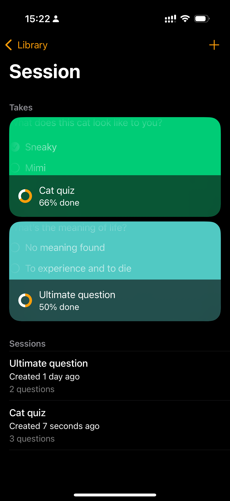
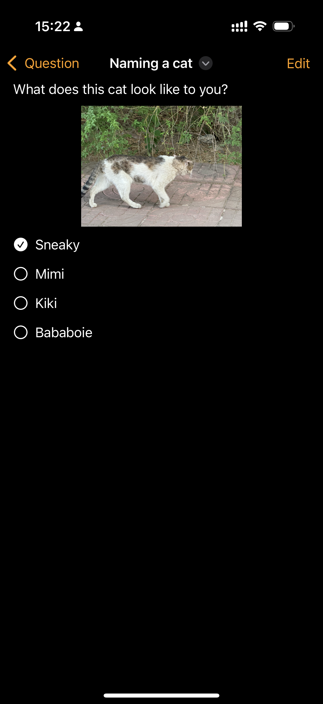
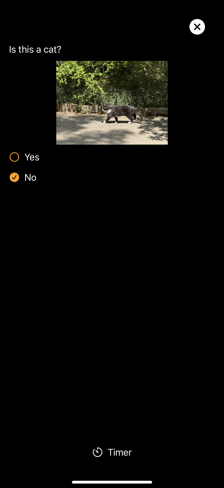

# Practiso

Personal, offline and intelligent study & practice utility. Learn smarter, not more.

## Screenshots

| Name                |                      Screenshot                      |
|:--------------------|:----------------------------------------------------:|
| Home                |                |
| Home iOS            |            |
| Quiz editor 1       |            |
| Quiz editor 2       |            |
| Quiz editor iOS     |        |
| Answer screen       |            |
| Answer screen iOS   |    |                 
| Take details dialog |  |

## Project Structure

This is a Kotlin Multiplatform project targeting Android, iOS, Desktop.
Android and desktop platforms utilize Jetpack Compose framework, while on iOS
SwiftUI is in play.

* `/shared` is for code that will be shared across the multiplatform applications.
  It contains several subfolders:
    - `commonMain` is for code that’s common for all targets.
    - Other folders are for Kotlin code that will be compiled for only the platform indicated in the
      folder name.
      For example, `appleMain` for Apple platform specifications.

While the above contribute to most of Practiso business logic, the following code brings
user experience to life.

* `/composeShared` is dependency of `/androidApp` and `/desktopApp`, containing subfolders for
  platform specific behaviors from how secondary click triggers to state management and navigation.

* `/iosApp` contains iOS applications, written in Swift. It interacts with Kotlin world through
  its ObjC interoperability, which compiles the `ComposeApp` Xcode framework.

Learn more
about [Kotlin Multiplatform](https://www.jetbrains.com/help/kotlin-multiplatform-dev/get-started.html)…
